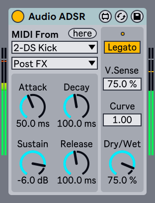

# Audio ADSR Max for Live Audio Effect

## What is this?
A super simple ADSR enveloper for audio tracks.

## Download
https://maxforlive.com/library/device/7508/audio-adsr

## Requirements
- Ableton Live 11.0.5 / Cycling '74 Max 8.1.11 or later

## Parameters
- `MIDI Input Type` Selects MIDI input type from MIDI tracks or external MIDI devices. Just like 'MIDI From' of MIDI tracks.
- `MIDI Input Channel` Selects MIDI Input Channel from selected input type above.
Available only when MIDI Input Type has selectable channels.
- `here` When pressed, MIDI Input will be routed to the track which the device belongs if the track is a MIDI track.
- `Attack` Adjusts the Attack time of the envelope.
- `Decay` Adjusts the Decay time of the envelope.
- `Sustain` Adjusts the Sustain volume of the envelope.
- `Release` Adjusts the Release time of the envelope, literally.
- `V. Sense` Adjusts the velocity sensitivity for the envelope's amplitude.
- `Curve` Adjust the Curvature of the envelope.
- `Dry/Wet` Adjust the ratio of processed sound and raw sound.
TIP: setting negative value produces like sidechain-compressed effect.
- `Legato` When enabled, the envelope wouldn't start with note on while playing at least one note.

## Known Issues
see (Issues)[https://github.com/h1data/M4L-Audio-ADSR/issues?q=]
